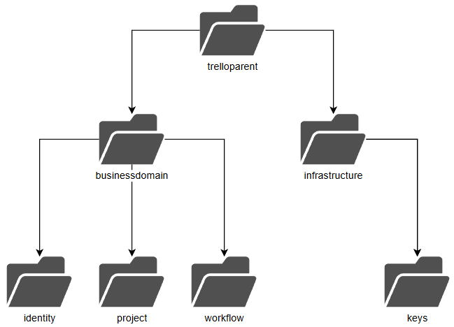
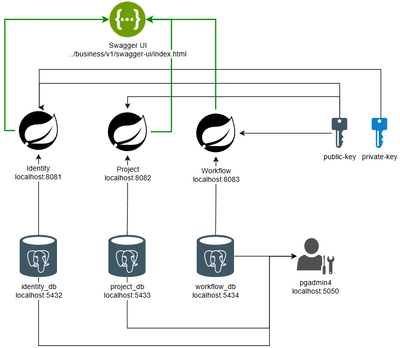
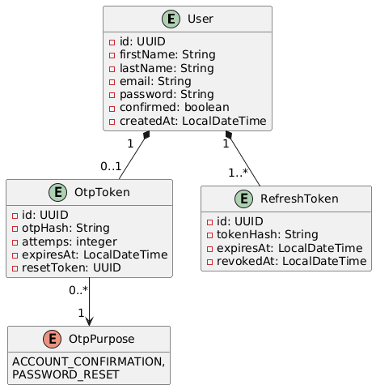
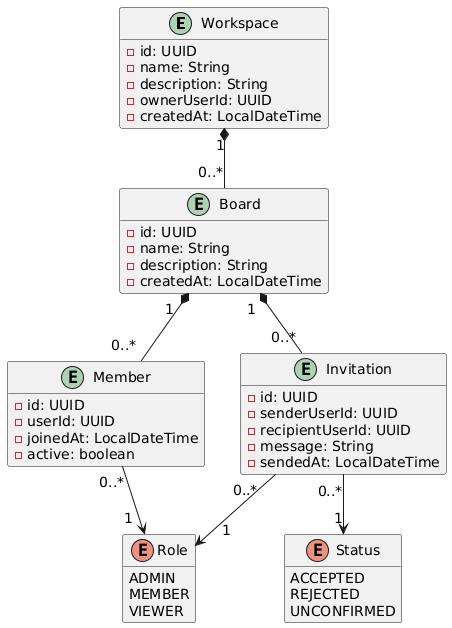
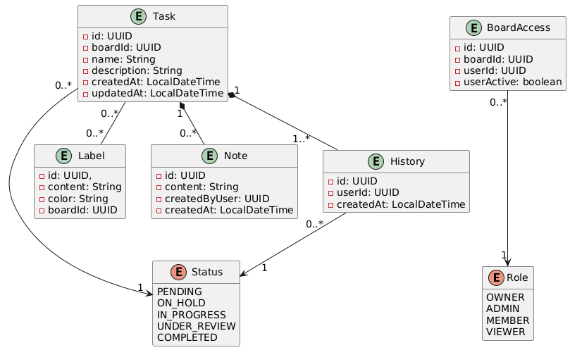

# TrelloMicroservices

Microservicios en un monorepositorio para una aplicación de Trello
## Patrón de monorepositorio

El proyecto utiliza el **patrón de monorepositorio (monorepo)** para organizar los diferentes microservicios y módulos que conforman la aplicación.

Bajo este enfoque, el código fuente de los distintos microservicios se mantiene dentro de un único repositorio. Esto permite centralizar el código del proyecto y facilita la reutilización de componentes y configuraciones comunes entre los diferentes módulos.

La estructura del proyecto aprovecha el sistema de gestión de dependencias de **Maven** y el modelo de herencia de proyectos de **Spring Boot/Maven**. En este caso, el proyecto utiliza un módulo padre denominado `**trelloparent**`, del cual hereda configuración y dependencias el módulo `**businessdomain**`. A partir de esta estructura se organizan los diferentes microservicios y módulos que forman parte del sistema.

Esta organización permite mantener una estructura común para los microservicios y compartir elementos que son necesarios en más de un módulo, evitando duplicar configuraciones y dependencias.

La siguiente imagen muestra la estructura de carpetas del repositorio y la relación entre los diferentes módulos:




## Diagrama de solución funcional en un entorno de desarrollo local

El siguiente diagrama representa la **solución funcional del sistema en un entorno de desarrollo local**.

En él se muestran los principales componentes que intervienen en la ejecución de la aplicación, incluyendo los microservicios desarrollados con **Spring Boot**, las bases de datos **PostgreSQL** utilizadas por cada microservicio y **pgAdmin 4** como herramienta para la administración de las bases de datos.

El diagrama también representa los elementos relacionados con la seguridad y la comunicación entre los componentes, como el uso del par de claves **RSA** para la generación, firma y validación de los tokens **JWT**, así como las URL utilizadas para acceder a las interfaces de **Swagger UI** de cada microservicio.

De esta manera, el diagrama proporciona una visión general de cómo se distribuyen los componentes del sistema y cómo se relacionan entre sí durante el desarrollo y ejecución local de la aplicación.



## Diagrama UML de entidades

Los siguientes 3 diagramas UML representan el **modelo de entidades de los microservicios que contienen la lógica de negocio**.

Cada microservicio mantiene su propio conjunto de entidades, las cuales representan los principales elementos del dominio y las relaciones existentes entre ellos.

El diagrama permite visualizar la estructura del modelo de datos de cada microservicio, incluyendo sus entidades, atributos y relaciones. Esto facilita la comprensión de cómo se encuentra organizado el dominio dentro de cada servicio y cómo se distribuyen las responsabilidades entre los diferentes microservicios.

### Identity



### Project



### Workflow



## Generación de claves RSA para JWT

El microservicio `identity` utiliza un par de claves RSA para firmar y validar los tokens JWT:

- `private-key.pem`: clave privada utilizada para **firmar** los JWT.
- `public-key.pem`: clave pública utilizada para **verificar** los JWT.

> **Importante:** nunca compartas ni subas `private-key.pem` al repositorio. La clave privada debe mantenerse protegida.

Por otro lado, los microservicios `Project` y `Workflow` utilizan la clave pública para verificar el JWT que se pasa en el encabezado (header) de una petición.

### 1. Instalar OpenSSL

Si OpenSSL todavía no está instalado, abre PowerShell y ejecuta:

```powershell
winget install openssl
```

Cuando se solicite, escribe `Y` para aceptar los términos y condiciones.

Después de la instalación, **cierra PowerShell y abre una nueva terminal**.

Comprueba que OpenSSL está instalado:

```powershell
winget list openssl
```

Deberías obtener una salida similar a:

```text
Name                   Id                       Version Source
---------------------------------------------------------------
OpenSSL 4.0.1 (64-bit) ShiningLight.OpenSSL.Dev 4.0.1   winget
```

### 2. Verificar que OpenSSL esté disponible en el PATH

Ejecuta:

```powershell
where.exe openssl
```

Si no encuentra el ejecutable, puedes localizarlo con:

```powershell
Get-ChildItem "C:\Program Files" -Filter openssl.exe -Recurse -ErrorAction SilentlyContinue
```

La instalación de OpenSSL utilizada por el proyecto debe encontrarse en:

```text
C:\Program Files\OpenSSL-Win64\bin\openssl.exe
```

Comprueba directamente su versión:

```powershell
& "C:\Program Files\OpenSSL-Win64\bin\openssl.exe" version
```

Deberías obtener:

```text
OpenSSL 4.0.1 9 Jun 2026 (Library: OpenSSL 4.0.1 9 Jun 2026)
```

### 3. Agregar OpenSSL al PATH

Si el comando `openssl` no es reconocido directamente desde PowerShell, agrega la siguiente ruta a las variables de entorno:

```text
C:\Program Files\OpenSSL-Win64\bin
```

Pasos:

1. Presiona `Windows + R`.
2. Ejecuta `sysdm.cpl`.
3. Ve a **Opciones avanzadas**.
4. Selecciona **Variables de entorno**.
5. En **Variables de usuario**, selecciona `Path`.
6. Pulsa **Editar**.
7. Pulsa **Nuevo**.
8. Agrega:

```text
C:\Program Files\OpenSSL-Win64\bin
```

9. Acepta todas las ventanas.
10. Cierra todas las terminales abiertas.
11. Abre una nueva terminal de PowerShell.

Finalmente, verifica:

```powershell
openssl version
```

y:

```powershell
where.exe openssl
```

La segunda orden debería mostrar:

```text
C:\Program Files\OpenSSL-Win64\bin\openssl.exe
```

### 4. Generar las claves RSA

Ubícate en el directorio `keys` del modulo `infrastructure`:

```powershell
cd infrastructure\keys
```

Genera la **clave privada**:

```powershell
openssl genrsa -out private-key.pem 2048
```

Luego genera la **clave pública** a partir de la clave privada:

```powershell
openssl rsa -in private-key.pem -pubout -out public-key.pem
```

El directorio debe quedar de esta manera:

```text
infrastructure/
└── keys/
    ├── private-key.pem
    └── public-key.pem
```

### 5. Verificar las claves

Puedes comprobar que la clave privada se haya generado correctamente con:

```powershell
openssl rsa -in private-key.pem -check
```

Deberías obtener:

```text
RSA key ok
```

También puedes comprobar la clave pública:

```powershell
openssl rsa -pubin -in public-key.pem -text -noout
```

### 6. No subir la clave privada a Git

Agrega la clave privada al `.gitignore`:

```gitignore
# JWT RSA keys
infrastructure/keys/private-key.pem
```

Si las claves se generan únicamente para desarrollo local, también puedes ignorar todo el directorio:

```gitignore
infrastructure/keys/*.pem
```

En producción, la clave privada debería gestionarse mediante un mecanismo seguro de secretos y **no almacenarse directamente en el repositorio**.

## Configuración de la infraestructura

El proyecto utiliza **Docker Compose** para definir y ejecutar la infraestructura necesaria para el funcionamiento de los microservicios en un entorno de desarrollo local.

Cada microservicio de lógica de negocio —**Identity**, **Project** y **Workflow**— utiliza una instancia independiente de **PostgreSQL**. Para facilitar la administración de las bases de datos se utiliza **pgAdmin 4**, también ejecutado mediante Docker.

La infraestructura se encuentra definida en el archivo:

```
docker-compose.yml
```

La configuración contempla los siguientes servicios:

| Servicio   | Contenedor    | Puerto |
| ---------- | ------------- | ------ |
| PostgreSQL | `identity-db` | `5432` |
| PostgreSQL | `project-db`  | `5433` |
| PostgreSQL | `workflow-db` | `5434` |
| pgAdmin 4  | `pgadmin4`    | `5050` |

> **Nota:** los puertos `5433` y `5434` corresponden a los puertos expuestos en el equipo local. Dentro de la red de Docker Compose, cada instancia de PostgreSQL utiliza su puerto interno `5432`.

### 1. Levantar la infraestructura

Ubícate en el directorio donde se encuentra el archivo `docker-compose.yml` y ejecuta:

```bash
docker compose up -d
```

La opción `-d` permite ejecutar los contenedores en segundo plano.

Para comprobar que los servicios se encuentran ejecutándose correctamente:

```bash
docker compose ps
```

También puedes utilizar:

```bash
docker ps
```

Deberían aparecer los cuatro contenedores correspondientes a las tres instancias de PostgreSQL y pgAdmin 4.
### 2. Verificar PostgreSQL

Para comprobar que una instancia de PostgreSQL se inició correctamente, puedes consultar los logs del contenedor:

```bash
docker logs identity-db
```

Cuando PostgreSQL haya iniciado correctamente, debería aparecer un mensaje similar a:

```text
database system is ready to accept connections
```

Este mensaje indica que el servidor PostgreSQL está ejecutándose y puede aceptar conexiones.

También puedes consultar los logs desde **Docker Desktop**, accediendo al panel **Containers**, seleccionando el contenedor correspondiente y abriendo la pestaña **Logs**.

La configuración de la base de datos de Identity es:

```text
Database: identity_db
Username: postgres
Password: admin
Port: 5432
```

Las bases de datos de los demás microservicios siguen una configuración equivalente:

```
Project:
Database: project_db
Username: postgres
Password: admin
Port: 5432

Workflow:
Database: workflow_db
Username: postgres
Password: admin
Port: 5432
```

> **Importante:** las variables `POSTGRES_DB`, `POSTGRES_USER` y `POSTGRES_PASSWORD` se utilizan para inicializar PostgreSQL cuando el directorio de datos se encuentra vacío. Si el directorio ya contiene un clúster de PostgreSQL inicializado, modificar estas variables no volverá a ejecutar el proceso de inicialización.

### 3. Verificar pgAdmin 4

Para comprobar que pgAdmin 4 se inició correctamente, consulta los logs de su contenedor:

```bash
docker logs pgadmin4
```

Debería aparecer un mensaje similar a:

```text
[INFO] Listening at: http://[::]:80 (1)
```

Esto indica que pgAdmin está escuchando correctamente dentro del contenedor.

También puedes comprobar el estado del contenedor desde **Docker Desktop**.

### 4. Acceder a pgAdmin 4

Una vez que el contenedor se encuentre ejecutándose, abre pgAdmin 4 desde el navegador:

[http://localhost:5050/](http://localhost:5050/)

Utiliza las credenciales definidas en `docker-compose.yml`:

```text
Email:    admin@gmail.com
Password: qwerty
```

### 5. Registrar las bases de datos en pgAdmin 4

Una vez dentro de pgAdmin 4, es necesario registrar las tres instancias de PostgreSQL.

En el panel izquierdo:

1. Haz clic derecho sobre **Servers**.
2. Selecciona **Register → Server...**.
3. Configura las pestañas **General** y **Connection**.
4. Pulsa **Save**.

#### Identity

En la pestaña **General**, utiliza:

```
Name: identity-postgres-db
```

Este nombre es únicamente un identificador dentro de pgAdmin y no tiene que coincidir con el nombre del contenedor.

En la pestaña **Connection**:

|Campo|Valor|
|---|---|
|Host name/address|`identity-postgres-db`|
|Port|`5432`|
|Maintenance database|`identity_db`|
|Username|`postgres`|
|Password|`admin`|

El valor `identity-postgres-db` corresponde al nombre del servicio de Docker Compose utilizado para establecer la comunicación entre los contenedores.

> **Importante:** cuando pgAdmin y PostgreSQL se encuentran dentro de la misma red de Docker Compose, no se debe utilizar `localhost` como host para establecer la conexión entre ambos contenedores. Se utiliza el nombre del servicio definido en Docker Compose.

#### Project
Registra un nuevo servidor desde **Register → Server...**.

En la pestaña **General**:

```
Name: project-postgres-db
```

En la pestaña **Connection**:

| Campo                | Valor                 |
| -------------------- | --------------------- |
| Host name/address    | `project-postgres-db` |
| Port                 | `5432`                |
| Maintenance database | `project_db`          |
| Username             | `postgres`            |
| Password             | `admin`               |
#### Workflow

Registra un tercer servidor.

En la pestaña **General**:

```
Name: workflow-postgres-db
```

En la pestaña **Connection**:

| Campo                | Valor                  |
| -------------------- | ---------------------- |
| Host name/address    | `workflow-postgres-db` |
| Port                 | `5432`                 |
| Maintenance database | `workflow_db`          |
| Username             | `postgres`             |
| Password             | `admin`                |

### 6. Verificar la base de datos

Después de registrar los servidores, puedes acceder a las bases de datos desde el árbol de navegación de pgAdmin.

Por ejemplo, para **Identity**:

```text
Servers
└── identity-postgres-db
    └── Databases
        └── identity_db
            └── Schemas
                └── public
                    └── Tables
```

Dentro de **Tables** deberían aparecer las tablas correspondientes a las entidades del microservicio Identity.

La creación y actualización de las tablas es gestionada por Hibernate mediante:

```properties
spring.jpa.hibernate.ddl-auto=update
```

Por lo tanto, las tablas serán creadas o actualizadas cuando el microservicio establezca correctamente la conexión con PostgreSQL.

El mismo procedimiento puede utilizarse para las bases de datos `project_db` y `workflow_db`.

### 7. Ejecutar los microservicios

Una vez que la infraestructura se encuentre disponible, puedes ejecutar los microservicios **Identity**, **Project** y **Workflow** desde el IDE o mediante Maven.

En VS Code, puedes utilizar **Spring Boot Dashboard** para administrar la ejecución de los módulos Spring Boot.

Dentro de la sección **Maven** podrás encontrar los diferentes módulos del proyecto.

Para cada microservicio se pueden utilizar las siguientes fases:

- `clean`: elimina los archivos generados durante compilaciones anteriores.
- `compile`: compila el código fuente y permite detectar errores de compilación.
- `package`: compila el proyecto y genera el artefacto correspondiente.

#### Ejecución desde Spring Boot Dashboard

Para ejecutar un microservicio:

1. Abre **Spring Boot Dashboard**.
2. Busca la sección **Apps**.
3. Localiza el microservicio que deseas ejecutar.
4. Pulsa **Run**.
5. Consulta los logs desde la consola integrada de VS Code.

#### Ejecución mediante Maven

También puedes ejecutar los microservicios desde una terminal externa, como PowerShell o **Warp**.

Por ejemplo, para ejecutar **Project**:

```
cd C:/projects/TrelloMicroservices/trelloparent/businessdomain/project
```

Luego ejecuta:

```
mvn spring-boot:run
```

Puedes utilizar `../` para desplazarte hacia el directorio padre desde la ubicación actual.

Repite el procedimiento para los microservicios **Identity** y **Workflow**.

### 8. Acceder a Swagger

Cada microservicio expone su propia interfaz de **Swagger UI**.

#### Identity

```
http://localhost:8081/business/v1/swagger-ui/index.html
```

#### Project

```
http://localhost:8082/business/v1/swagger-ui/index.html
```

#### Workflow

```
http://localhost:8083/business/v1/swagger-ui/index.html
```

La estructura de estas URL es:

```
http://localhost
       :PORT
       /business/v1
       /swagger-ui/index.html
```

Donde:

- `PORT` corresponde al puerto asignado al microservicio.
- `/business/v1` corresponde al `server.servlet.context-path`.
- `/swagger-ui/index.html` corresponde a la interfaz de Swagger UI.

## Limpiar los datos

### 1. Detener los contenedores

Para detener toda infraestructura, ejecuta en la terminal:

```bash
docker compose down
```

Esto detiene y elimina los contenedores, pero **no elimina los datos almacenados en `postgres_data`**.
### 2. Cambiar la configuración inicial de PostgreSQL

Tomando el microservicio Project, si se modifica alguna de las siguientes propiedades:

```yaml
POSTGRES_USER: postgres
POSTGRES_PASSWORD: admin
POSTGRES_DB: identity_db
```

y se necesita que PostgreSQL realice nuevamente su inicialización, primero se debe detener la infraestructura:

```bash
docker compose down
```

Después, elimina el directorio:

```text
postgres_data_project/
```

Finalmente, vuelve a levantar los servicios:

```bash
docker compose up -d
```

Esto es necesario porque PostgreSQL **no vuelve a ejecutar su proceso de inicialización mientras el directorio `/var/lib/postgresql/data` ya contenga un clúster existente**.

> ⚠️ **Advertencia:** eliminar `postgres_data_project` elimina los datos almacenados en esa instancia de PostgreSQL. Hazlo solamente si no necesita conservar los datos de los demás microservicios.


## Comprobar un password BCrypt

Después de registrar un usuario desde Swagger, puedes consultar el password almacenado en PostgreSQL mediante pgAdmin4.

El valor almacenado será un hash BCrypt, por ejemplo:

```text
$2a$10$...
```

Para comprobar si una contraseña corresponde con ese hash puedes utilizar:

[BCrypt Generator](https://bcrypt-generator.com/?utm_source=chatgpt.com)

Introduce:

- **Password:** la contraseña original utilizada durante el registro.
- **Hash:** el valor BCrypt almacenado en la columna `password` de PostgreSQL.

> ⚠️ No utilices contraseñas reales o sensibles en servicios web de terceros. Para pruebas de desarrollo utiliza únicamente contraseñas ficticias.
